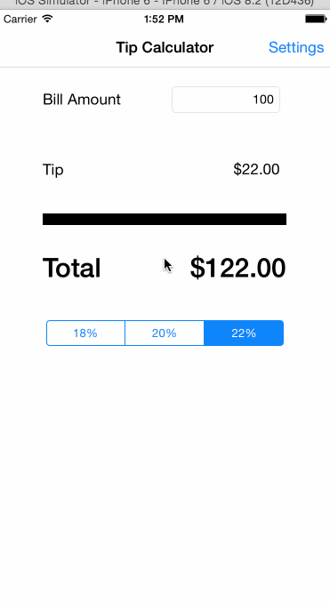

MyTipCal
========
Simple Swift Tip Calculator Application.

Completed user stories:

 * [x] Able to set default tip percentage
 * [x] Able to set background theme
 * [x] Bill amount will set to blank automatically, if the application is in background more than 10 minutes
 * [x] Labels and segment control will be disappeared, if the bill amount is blank

GIF created with [LiceCap](http://www.cockos.com/licecap/).
